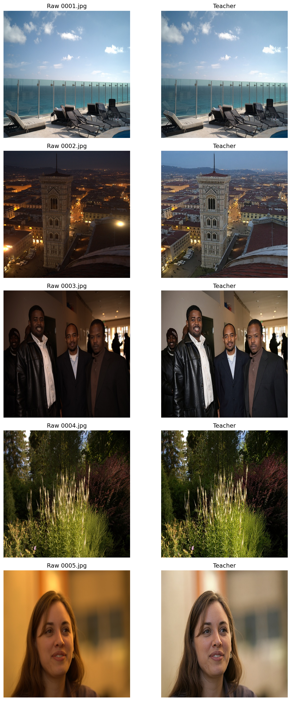
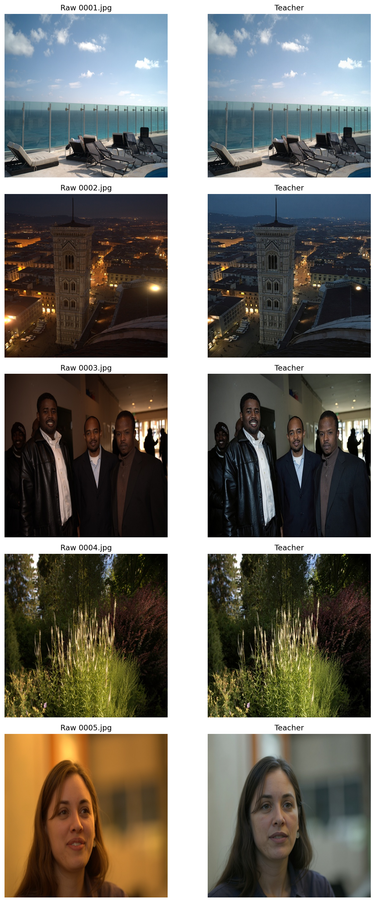

# Personalized Photo Editing

This is a proof-of-concept personalized photo-editing system. Instead of applying one generic enhancement model to every user, it learns a photographer's preferred finish from their own portfolio and distills that behavior into a lightweight student adapter.

## What This Repo Contains

The current branch is the cleaned-up v2 pipeline:

1. *Style discovery*  
   BLIP-2 captions 50 edited images per photographer and DeepSeek V3.2 compresses those captions into one editing-style sentence.
2. *Teacher generation*  
   FLUX.1 Kontext [pro] acts as the high-quality teacher and creates personalized target edits while preserving scene structure.
3. *Student distillation*  
   An edit-conditioned InstructPix2Pix LoRA is trained on `(raw -> teacher)` pairs so the deployed model is small, local, and much cheaper to run than the teacher.
4. *Demo app*  
   A Streamlit app presents the product story, visual evidence, and local student inference for Candidate C and Candidate D.

## Key Outputs

- `style_c.txt` and `style_d.txt`
- `student_ip2p_v2/expert_c/` and `student_ip2p_v2/expert_d/`
- `student_ip2p_v2_r8/expert_c/` and `student_ip2p_v2_r8/expert_d/`
- `assets/demo_grid_student_v2_r8.png`
- `assets/loss_curves_v2_r8.png`
- `assets/teacher_preview_c_v2.png`
- `assets/teacher_preview_d_v2.png`

## Visual Results


The stronger `r=8`, `2000`-step students are the current best local run. Candidate C stays brighter, cleaner, and more neutral, while Candidate D stays cooler, darker, and more muted.





## Run Locally

Create and activate the local environment:

```bash
cd ~/autohdr
source venv/bin/activate
```

Run the Streamlit demo:

```bash
streamlit run app.py
```

The app can display the evidence assets immediately. If the local ML stack from `requirements-ml.txt` is installed and the student adapters exist, it can also run personalized student inference on uploaded images.

## Dependency Notes

- `requirements.txt` is the lightweight app-facing dependency file.
- `requirements-ml.txt` is the full local ML stack used for teacher generation, student training, and local inference.
